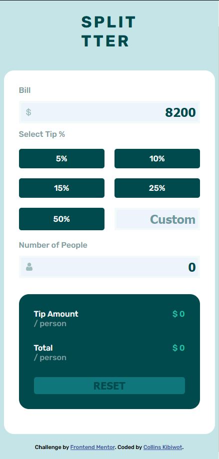

# Frontend Mentor - Tip calculator app solution

This is a solution to the [Tip calculator app challenge on Frontend Mentor](https://www.frontendmentor.io/challenges/tip-calculator-app-ugJNGbJUX). Frontend Mentor challenges help you improve your coding skills by building realistic projects.

## Table of contents

- [Overview](#overview)
  - [The challenge](#the-challenge)
  - [Screenshot](#screenshot)
  - [Links](#links)
- [My process](#my-process)
  - [Built with](#built-with)
  - [What I learned](#what-i-learned)
  - [Continued development](#continued-development)
  - [Useful resources](#useful-resources)
- [Author](#author)
- [Acknowledgments](#acknowledgments)


## Overview

### The challenge

Users should be able to:

- View the optimal layout for the app depending on their device's screen size
- See hover states for all interactive elements on the page
- Calculate the correct tip and total cost of the bill per person

### Screenshot





### Links

- Solution URL: [GitHub](https://github.com/kibiwotkosgei/Tip-calculator-app)
- Live Site URL: [GitHub Pages](https://kibiwotkosgei.github.io/Tip-calculator-app/)

## My process
I started to by analysing the project.I set up the HTML code then worked on the functionality side.Later styled with CSS.Started with the mobile view then finished with the desktop view.

### Built with

- Semantic HTML5 markup
- CSS custom properties
- Flexbox
- CSS Grid
- Javascript

### What I learned

I learned to manipulate the DOM.I am still learning a lot.

```html
<h1>Some HTML code I'm proud of</h1>

<div id="tip" class="tip">
  <button class="btn">5%</button>
  <button class="btn">10%</button>
  <button class="btn">15%</button> 
  <button class="btn">25%</button>
  <button class="btn">50%</button>
  <input type="number" placeholder="Custom" class="input-custom" id="custom">
</div>
<div id="people">
<label for="noofpeople" >Number of People </label>
  <input type="number" class="input-noofpeople" placeholder="0" id="noofpeople">
</div>
</div>


```
```css
.proud-of-this-css {
  
@media (width > 650px) {
    main{
        display: flex;
        gap: 2rem;
    }
    .tipcalc, .minorbox{
        flex:1;  
    }
    .tip{
        grid-template-columns: 1fr 1fr 1fr;
    }
}

}
```
```js

tipButtons.forEach((btn) => {
    btn.addEventListener("click", function(){
        let tip = parseInt(btn.textContent);
        let tipPerPerson = (tip/100*bill)/noOfPeople;
        let totalPerPerson= tipPerPerson + (bill/noOfPeople);
        tipPerPersonPara.innerHTML = tipPerPerson;
        totalPerPersonPara.innerHTML = totalPerPerson;

        if(noOfPeople <= 0){
            tipPerPersonPara.innerHTML = "$0.00";
            totalPerPersonPara.innerHTML = "$0.00";
            document.getElementById("people").classList.add("nopeople");
        }
    })
})
 
```
### Continued development

I want to continue focusing on the javascript side of the app.I want to work on the custom part and the reset button.Also,I want to refine and perfect the DOM manipulation.I want to take more time in developing my css skills in the near future.


### Useful resources

- [W3Schools](https://www.w3schools.com/jsref/prop_element_classlist.asp) - This helped me to add a class in JS. I really liked it and will use it going forward.
- [MDN web docs](https://developer.mozilla.org/en-US/docs/Web/CSS/flex) - This webpage helped me refresh on the flex property.

## Author


- Frontend Mentor - [@kibiwotkosgei](https://www.frontendmentor.io/profile/kibiwotkosgei)
- GitHub - [@kibiwotkosgei](https://github.com/kibiwotkosgei)


## Acknowledgments
- [Kibenon Collins](https://www.frontendmentor.io/profile/collinskibenon)-Challenged me to do this cahllenge,guided me and was very insightful and inspiring.
- [Lesley Kimutai](https://www.frontendmentor.io/profile/Leskim)  Helped debug my code.

Thank you punny friends.Whips!
